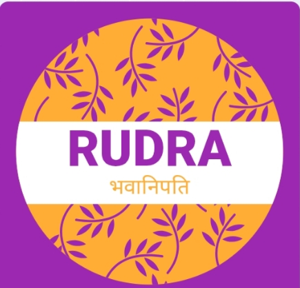

<!DOCTYPE html>
<html lang="en">
<head>
  <meta charset="UTF-8" />
  <meta name="viewport" content="width=device-width, initial-scale=1.0" />
  <title>Rudra Digital Marketing of India</title>
  <meta name="description" content="Rudra Digital Marketing of India offers expert digital marketing services like SMM, PPC, Content Strategy, and Website Design.">
  <meta name="keywords" content="Digital Marketing, Social Media, PPC, Website Design, Content Strategy, Rudra India">
  <meta name="author" content="Anand Shukla">
  
</head>
<body>

  <header>
    
    <h1>Rudra Digital Marketing of India</h1>
    
Empowering Your Brand in the Digital World

  </header>

  <nav>
    <a href="#about">About</a>
    <a href="#services">Services</a>
    <a href="#contact">Contact</a>
    <a href="#owner">Owner Details</a>
  </nav>

  <main>
    <section id="about">
      <h2>About Us</h2>
      

        Rudra Digital Marketing of India is a leading digital marketing agency
        committed to delivering measurable results through innovative strategies.
        We specialize in helping businesses grow online through targeted campaigns
        and cutting-edge technology.
      

    </section>

    <section id="services">
      <h2>Our Services</h2>
      <ul>
        <li>HTML Code Specialization</li>
        <li>Social Media Marketing</li>
        <li>Pay-Per-Click Advertising (PPC)</li>
        <li>Content Strategy</li>
        <li>Website Design</li>
      </ul>
    </section>

    <section id="contact">
      <h2>Contact Us</h2>
      
<strong>Email:</strong> <a href="mailto:anandshukla221206@gmail.com">anandshukla221206@gmail.com</a>

      
<strong>Phone 1:</strong> <a href="tel:+918467063125">+91-8467063125</a>

      
<strong>Phone 2:</strong> <a href="tel:+919161174816">+91-9161174816</a>

      
<strong>Mobile:</strong> <a href="tel:+91 95321 56562">++91 95321 56562</a>

      
<strong>Mobile:</strong> <a href="tel:+919452789402">+91-9452789402</a>

      
<strong>Mobile:</strong> <a href="tel:+919794585571">+91-9794585571</a>

      
<strong>Address:</strong> Naini, Prayagraj, India

    </section>

    <section id="owner">
      <h2>Owner Details</h2>

      <!-- Founder & Co-Founder Group -->
      

        

          <h3>Founder: Anand Shukla</h3>
          
          
<strong>Mobile:</strong> <a href="tel:+918467063125">+91-8467063125</a>

           <h3>email id-anandshukla221206@gmail.com</h3>
        

        

          <h3>Co-Founder: Anupam Panday</h3>
          
          
<strong>Mobile:</strong> <a href="tel:+919161174816">+91-9161174816</a>

          <h3>email id-anupampandeyunique@gmail.com</h3>
        

      

      <!-- Manager & Co-Managers Group -->
      

        

          <h3>Manager: Anuj Maurya</h3>
          
          
<strong>Mobile:</strong> <a href="tel:+91 95321 56562">++91 95321 56562</a>

          
<strong>Email:</strong> anujmaurya0104@gmail.com

        

        

          <h3>Co-Manager: Anand Singh</h3>
          
          
<strong>Mobile:</strong> <a href="tel:+919452789402">+91-9452789402</a>

          
<strong>Email:</strong> anands46933@gmail.com

        

        

          <h3>Co-Manager: Aman Maurya</h3>
          
          
<strong>Mobile:</strong> <a href="tel:+919794585571">+91-9794585571</a>

          
<strong>Email:</strong> amanjiimaurya1310@gmail.com

        

      

    </section>
  </main>

  <footer>
    
&copy; 2025 Rudra Digital Marketing of India. All rights reserved.

  </footer>

</body>
</html>
